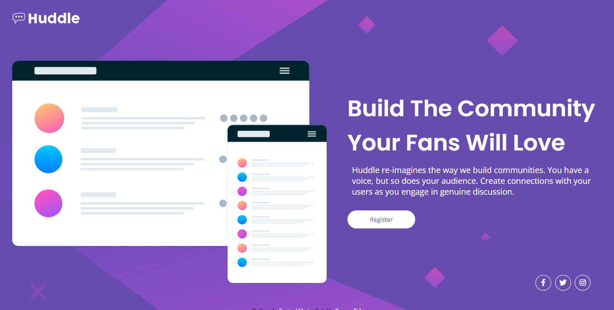

# Frontend Mentor - Huddle landing page with single introductory section solution

This is a solution to the [Huddle landing page with single introductory section challenge on Frontend Mentor](https://www.frontendmentor.io/challenges/huddle-landing-page-with-a-single-introductory-section-B_2Wvxgi0). Frontend Mentor challenges help you improve your coding skills by building realistic projects. 

## Table of contents

- [Overview](#overview)
  - [The challenge](#the-challenge)
  - [Screenshot](#screenshot)
  - [Links](#links)
- [My process](#my-process)
  - [Built with](#built-with)
  - [What I learned](#what-i-learned)
  - [Continued development](#continued-development)
- [Author](#author)

## Overview

### The challenge

Users should be able to:

- View the optimal layout for the page depending on their device's screen size
- See hover states for all interactive elements on the page

### Screenshot



### Links

- Solution URL: [https://www.frontendmentor.io/solutions/huddle-landingpage-Z-L4v0sMot](https://www.frontendmentor.io/solutions/huddle-landingpage-Z-L4v0sMot)
- Live Site URL: [https://huddlee1.netlify.app/](https://huddlee1.netlify.app/)

## My process

### Built with

- Semantic HTML5 markup
- CSS custom properties
- Flexbox
- Fonts from [fontawesome.com](https://fontawesome.com)
- Visual Studio Code
- Chrome Developer Tools

### What I learned

    I was able to make use of media queries  for my responsive design without referring to any website or document and was also able to use svg as backgrounds. See the code snippet below:

```html
<header>
    
</header>
```
```css
header img
{
    width: 200px;
    padding: 20px;
}
```


### Continued development

    I am going to keep on taking on challenges that require responsive design so as to master media queries


## Author

- Frontend Mentor - [@devTetra](https://www.frontendmentor.io/profile/devTetra)
- Twitter - [@tetra_codes](https://twitter.com/tetra_codes)
